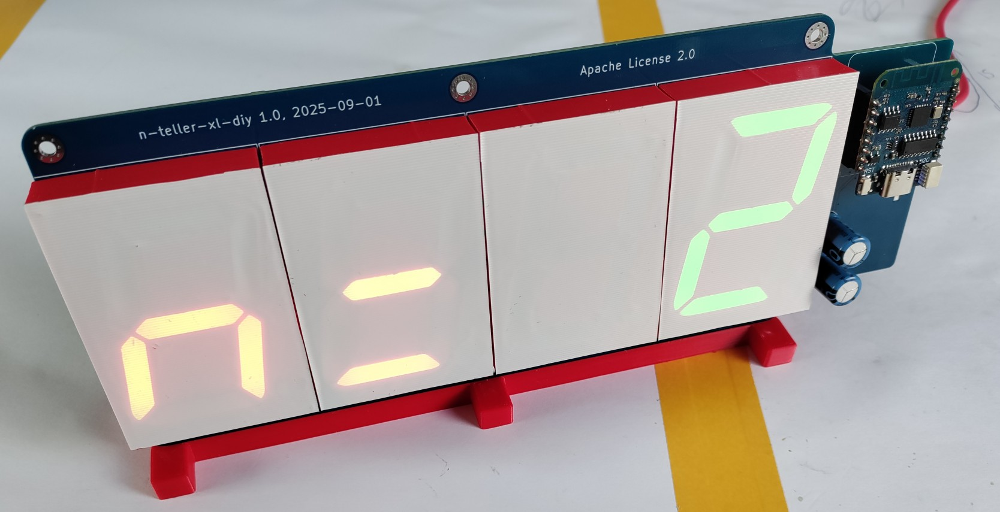
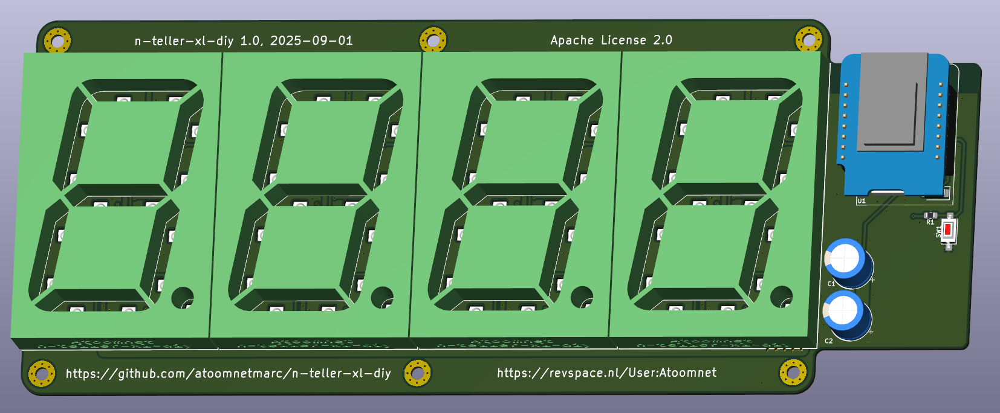
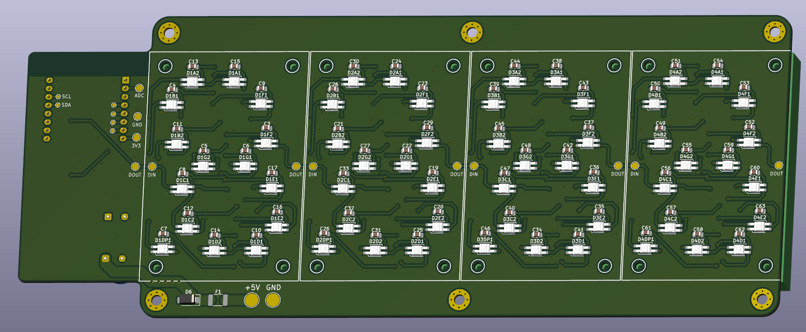

**Status**: finished and working.

**Soldering and assembly time**: about 4 hours (if you can solder well).

# n-teller-xl-diy

n-teller-xl-diy is an IoT device that displays the number of [checked in participants and visitors](https://revspace.nl/N) at the hackerspace called [Revelation Space (or RevSpace)](https://revspace.nl).

It connects to the [RevSpace MQTT server](https://revspace.nl/MQTT) via WiFi using an ESP8266.

The MQTT server publishes to [a few topics of interest](https://revspace.nl/MQTT#Topics) that are subscribed:

- revspace/[doorduino](https://revspace.nl/Doorduino3)/checked-in: this is the current total of checked-in people.
- revspace/[state](https://revspace.nl/Spacestatus): the current state (open or closed) of the hackerspace.

# Schematic

[hardware/n-teller-xl-diy-schematic.pdf](hardware/n-teller-xl-diy-schematic.pdf)

# BOM

See interactive BOM: [hardware/bom/](https://html-preview.github.io/?url=https://github.com/atoomnetmarc/n-teller-xl-diy/blob/main/hardware/bom/ibom.html)

You will also need:

- The pcb. See [hardware/gerber/](hardware/gerber/) for gerber files. Order it at some PCB fabricator. You can also ask me for a bare PCB when I am at [RevSpace](https://revspace.nl/) hackerspace. I may have some left. I sell them for €5 a piece.
- 4x 3D prints of `7-segment 2.3 inch.stl` in opaque colored plastic.
- 1x 3D print of `n-teller-xl-diy-stand.stl` in the color of your choice.
- 16x M2x10 self-tapping hex screws to mount the 4 7-segment 3D prints to the PCB.
- 3x M3x12 BHCS screws to mount the PCB to the 3D printed stand.
- About 28cm of 5cm wide vinyl white tape to stick onto the face of the 3D printed 7-segment digits. Or some other kind of 20x8cm thin white sticky plastic.

# Render

# Assembly

Last time I made assembly instructions for the [n-teller](https://github.com/atoomnetmarc/n-teller) at https://revspace.nl/N-teller, but that was not used, everybody just asked what to do, even after telling there are assembly instructions.

So for this one I won't make instructions. Just follow the BOM and look at the pictures on this page, and figure things out yourself.

Use a 5V power supply that can provide at least 1A.

# Firmware

Compile and flash the firmware located in the [firmware directory](firmware/). You will need [PlatformIO](https://platformio.org/) for this. I recommend installing the [PlatformIO extension for VSCode](https://platformio.org/install/ide?install=vscode).

# Configure WiFi

Double press the reset button (somewhat slowly). The letters `AP` will appear on the display. Now connect to a WiFi network with a name like `nteller-bcddc2895fd2`. Then goto: http://192.168.4.1/ and configure your WiFi.

# (Frequently) Asked Questions

> Do I really need the level shifter?
>
> -- <cite>User that does not know that the high signal level of 3.3V is lower than the VIH (3.5V) of the SK6812</cite>

Oh, sure, because nothing says "reliable electronics" like ignoring basic signal integrity! No, you don't *really* need the level shifter. Just blob some solder on `JP1` and cross your fingers that your 3.3V signals magically play nice with those finicky SK6812s. But when your display starts glitching like it's possessed by a deranged hacker, don't you dare come whining to me – after all, you're the self-proclaimed expert who thought this was a brilliant idea. Good luck with that masterpiece!

On serious note. It depends. I had 2 batches of SK6812 LEDS's. One batch worked on 3.3V DIN, but VCC must be below 5.1V, any higher and it did not work. The other batch did not work, even after lowering VCC to below 4.5V. So, yes, you need a level shifter.

